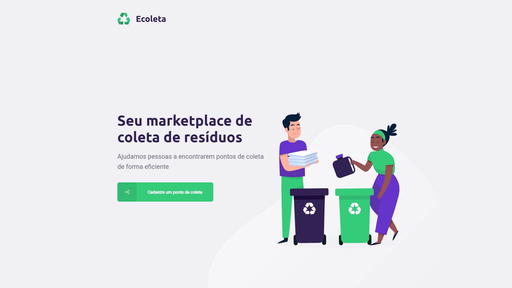
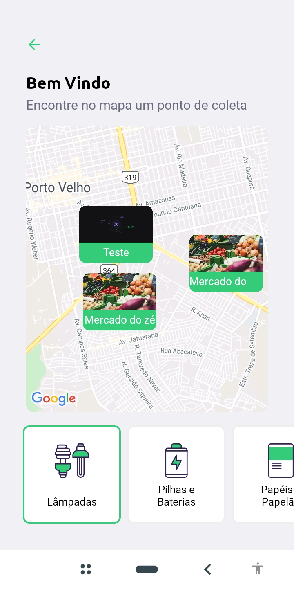
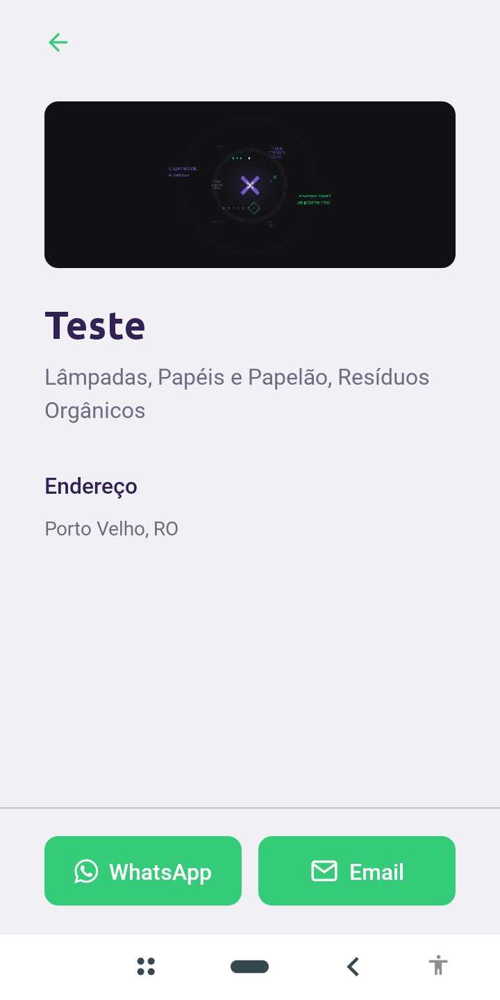

# NLW #01

## Ecoleta

O projeto Ecoleta desenvolvido durante a NLW #01 é uma forma de cadastrar e visualizar pontos de coleta de materiais recicláveis como papelão e materiais que precisam de um ponto de coleta especial como pilhas e baterias.

O projeto é desenvolvido em três partes: 

- Server Node.js
- Web - React.js
- Mobile - React-Native

### Server

O Servidor foi construído a partir do Node.js, utilizando o Express para gerenciar as rotas da API. Por outro lado utilizamos um banco sqlite para armazenar os registros dos pontos de coleta e os items (papelão, pilhas etc...).

### Web

O front-end web foi criado a partir do React.js, utilizamos o Axios para interagir com a nossa API, assim podemos receber e enviar os dados para o servidor.

### Mobile

Nosso aplicativo foi criado com React-Native + Expo, assim como o cliente web o app consome dados da API para mostrar em um mapa onde estão os pontos de coleta da cidade que você escolheu.

--------------------------------------------------------------------------------------------------------------------------

Foi uma semana de muitos aprendizados!
